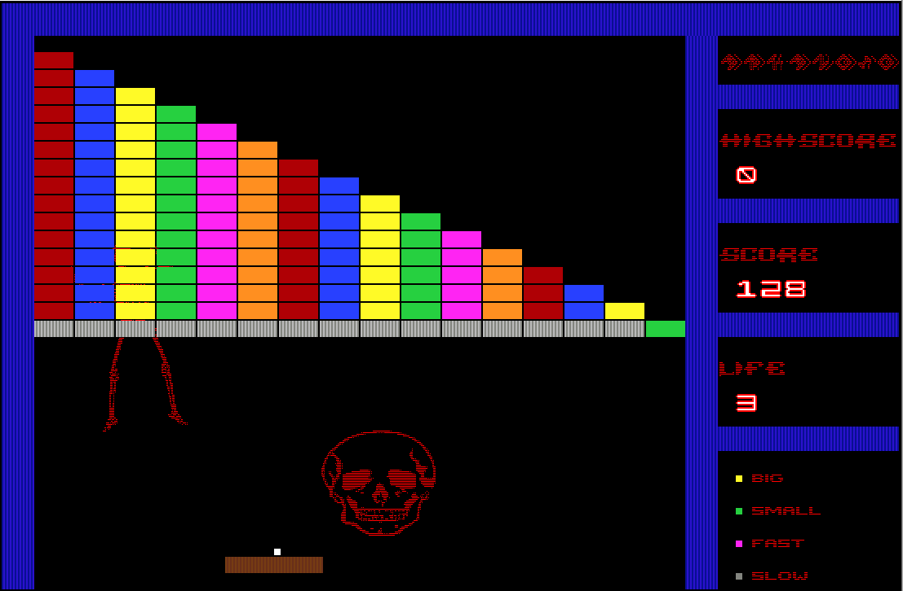

# Arkanoid-Game
This Project is an homage to the c64 game 'Arkanoid'. It was programmed as a Project for Deggendorf Institute of Technology.
The game does not use any images. Everything is handdrawn or created using Loops and ASCII-Art, which adds a rustical 'oldschool' style to it.

